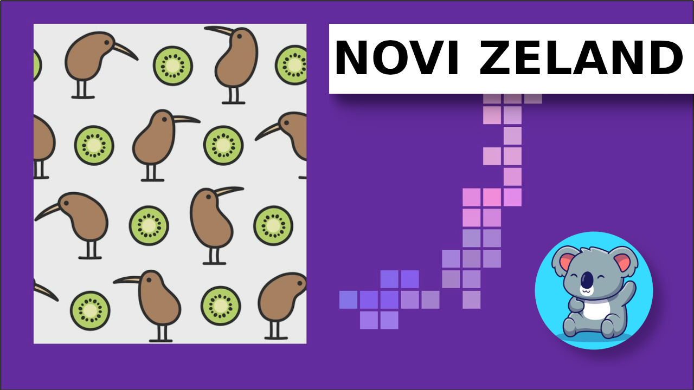

# Novi Zeland

https://www.youtube.com/watch?v=y6UigtH8XzA

Novi Zeland je drzava koja se nalazi u Tihom okeanu. Cine je dva velika ostrva i mnostvo manjih. Njen glavni grad je Velington, koji je ujedno i najjuznija prestonica na svetu.

Na zastavi ove zemlje se nalazi umanjena zastava Velike Britanije i 4 zvezde koje se vide na nebu Novog Zelanda, a ne vide se na nebu iznad nas.
Pored engleskog jezika, ovde se govori i Maorski, jezik ljudi koji su oduvek ziveli na ovim ostrvima, a na njihovom jeziku Novi Zeland se kaze Ao-tea-roa, sto znaci "zemlja dugog belog oblaka"

Novi Zeland ima preko 50 vulkana od kojih su neki jos uvek aktivni. Priroda je prelepa i postoji mnogo razlicitih i jedinstvenih vrsta biljaka i zivotinja. Voda u Plavom jezeru u jednom nacionalnom parku je najcistija voda na svetu.

Novi Zeland je poznat i po najvecem broju ovaca u odnosu na broj ljudi. Na jednog stanovnika dolazi cak 9 ovaca.

Kada smo kod zivotinja, ova zemlja je staniste i ptice kivi, po kojoj i Novozelandjane zovu od milja - kivi. Istoimeno voce je dobilo naziv po ovoj ptici jer su vrlo slicnog izgleda, ali voce kivi potice iz Kine, dok je ptica sa Novog Zelanda.

Izuzetno zanimljiv je naziv jednog brda, koji sa svojih 105 slova predstavlja mesto sa najduzem imenom na svetu.

To je Taumata-vakatangi-­hangako-auauota-matea­tu-ripu-kakapiki-maunga-­horonu-kupokai-ven­uaki-tanatahu koga Novozelandjani zovu krace Taumata. Interesantan je i prevod sa Maorskog jezika i znaci "vrh gde Tamatea, covek sa velikim kolenima, klizac, planinar i putujuci gutac zemlje, svirao flautu svojoj voljenoj"

Mnogo filmova, poput trilogija "Hobita" i "Gospodara prstenova", "Avatara" i "Letopisa Narnije" je snimljeno na Novom Zelandu i kroz njih se moze uzivati u ovoj prelepoj zemlji.

Nacionalni sport je ragbi, u cemu je ova zemlja trostruki sampion sveta. Novozelandska ragbi reprezentacija "Ol bleksi" pre svake utakmice izvodi Haku. To je vrsta tradicionalnog ratnog plesa Maora, koji se izvodi u grupi energicnim udaranjem nogama po zemlji uz glasne uzvike. Ovaj ples se nekada koristio za zastrasivanje protivnika, a sada je sastavni deo dobrodoslice za ugledne goste.

I to vam je, drage male koale, kratka prica o Novom Zelandu

